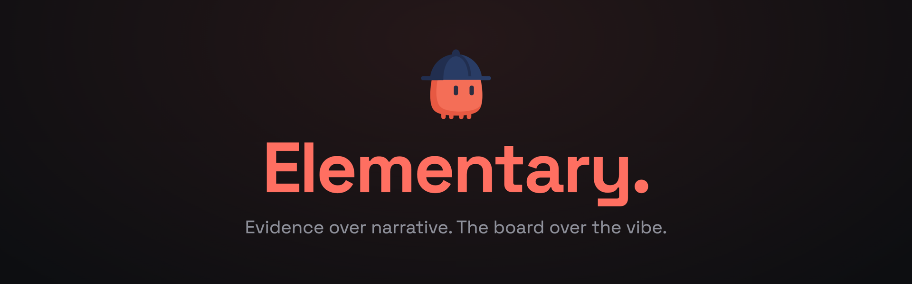

<!-- Hero: docs/hero.png — the mini mascot in its navy inspector cap over the
"Elementary." wordmark and the project's thesis line. The square mascot art is
docs/mascot.png (the Case Board logo); docs/banner.jpeg remains the wide
detective-and-logs art (GitHub social preview); the terminal banner the skill
prints is a text wordmark, not a sprite. See docs/brand.md. -->
<p align="center">
  
</p>

# sherlog

> *Elementary, dear developer.*

Hypothesis-driven debugging for Claude Code. A single Go binary that runs as a
localhost daemon and an MCP server, plus a `/debug` skill that drives a
detective loop: name suspects, plant one discriminating probe each, wait while
you reproduce the bug, then eliminate suspects from real evidence — and remove
every probe before it calls the case closed.

It replaces "dump the logs into the chat and hope" with a structured
investigation whose state — bug, hypothesis board, probe registry, run history —
lives in the daemon, not the conversation. It survives `/clear`, context
compaction, a crash, or picking the case back up days later via `/debug resume`.
Probes are browser-safe HTTP POSTs, so the same one-liner works in the browser,
Node, Python, Go, Ruby, or a shell.

## Install

sherlog has two parts that version together: the binary and the Claude Code
plugin. **Install the binary first** — the plugin's MCP server launches `sherlog`
from your PATH.

1. **Binary** — pick the channel for your OS:

   **macOS / Linux** (Homebrew):

   ```sh
   brew install neomodular/tap/sherlog
   sherlog --version
   ```

   **Windows** (Scoop):

   ```powershell
   scoop bucket add neomodular https://github.com/neomodular/scoop-bucket
   scoop install sherlog
   sherlog --version
   ```

   **Windows** (manual, no Scoop): download
   `sherlog_<version>_windows_amd64.zip` from the
   [latest release](https://github.com/neomodular/sherlog/releases/latest),
   extract `sherlog.exe` into a folder on your `PATH` (e.g.
   `%USERPROFILE%\bin`), then confirm with `sherlog --version`.

2. **Plugin** (Claude Code): inside any Claude Code session, run:

   ```
   /plugin marketplace add neomodular/sherlog
   /plugin install sherlog@sherlog
   ```

   then restart Claude Code (or `/reload-plugins`). The plugin ships
   `.mcp.json`, which launches `sherlog mcp`; once the binary is on PATH,
   `/debug` is available with no further configuration.

If the plugin's MCP server fails to start, the binary is almost certainly not on
PATH — reinstall it for your OS above (on Windows, open a **new** terminal so the
updated `PATH` is picked up), or see
[docs/troubleshooting.md](docs/troubleshooting.md).

## 60-second tour

1. **Open a case.** `/debug` — describe the bug, or let Claude ask a sharp
   question or two. Claude calls `debug_start`, prints the Watson banner, and
   commits at least three distinct suspects to the board.
2. **Plant probes.** One discriminating probe per suspect — a single
   fire-and-forget HTTP line, registered with its file, line, the hypothesis it
   tests, and a recorded prediction of what its payload looks like if that
   suspect is guilty vs. innocent. See
   [docs/probe-contract.md](docs/probe-contract.md).
3. **The game is afoot.** Claude asks you to reproduce the bug (rebuild/restart
   if the app is compiled or bundled) and blocks on `await_run` until probe
   activity goes quiet.
4. **Verdict.** You report `reproduced` / `not-reproduced`; Claude reads the
   per-probe evidence summary and kills or refines suspects from it. Every kill
   and confirm must cite the probe and run that prove it — the daemon
   cross-checks the citation against its own records and **rejects uncited or
   unsupported verdicts** with a repair instruction. Discipline is mechanical,
   not honor-system.
5. **Measure the blast radius.** With the culprit confirmed and before the fix,
   Claude proposes a regex for the defect anti-pattern; the **daemon runs the
   search itself** across your project and records every sibling hit — a pattern
   that misses the confirmed culprit is rejected as false coverage. Claude
   grades each hit (`sibling-bug` / `safe` / `already-covered`).
6. **Fix and verify.** Claude records how the evidence *should* change, fixes,
   runs a `fixed-check` reproduction, and confirms the signature changed as
   predicted — **"elementary."**
7. **Case closed.** `debug_end` lists every probe not yet removed; Claude deletes
   them and greps the repo for the session URL fragment, requiring zero matches
   before declaring **"case closed."**

Watch it live in the browser: while the daemon runs, open
**`http://127.0.0.1:2218/`** for the read-only **Case Board** (cases, suspect
board, probe registry, run comparison, a live evidence tail, and stale probes).
A full dogfood walkthrough is in [`examples/DOGFOOD.md`](examples/DOGFOOD.md).

`/debug resume` reconstructs an investigation from the daemon board after
`/clear`, compaction, a crash, or days later.

## Documentation

- **[Probe contract](docs/probe-contract.md)** — the per-language one-liner,
  fire-and-forget and content-type rules, URL anatomy, greppability.
- **[MCP tools reference](docs/tools-reference.md)** — every tool's parameters,
  result shape, and example.
- **[Troubleshooting](docs/troubleshooting.md)** — port conflicts, zero events,
  binary not on PATH, stale probes, where data lives.
- **[Architecture](docs/architecture.md)** — components, storage layout, and the
  await/debounce, flood-control, and adoption mechanics.
- **[Configuration](docs/configuration.md)** — every config key, precedence, and
  the `sherlog config` CLI.
- **[Brand](docs/brand.md)** — mascot, colors, and vocabulary.

## Why the fixed port

Port **2218** is 221B Baker Street — Sherlock Holmes's address. The fixed port is
the brand and what makes a sherlog probe instantly recognizable in a diff. Set
`SHERLOG_PORT` to move it; probe URLs follow automatically.

## Security

sherlog is built for **local debugging only**, with defense in depth: the daemon
binds `127.0.0.1` (never reachable off the machine), session paths are
unguessable random tokens so drive-by localhost POSTs go nowhere, unknown-session
requests are dropped, and the Case Board is strictly read-only. Investigation
data — including values seen by probes, and any field notes — stays on your
machine; there is no upload or telemetry. The Case Board exposes that data to any
local browser user, the same trust boundary as the files under `~/.sherlog`. See
[docs/architecture.md](docs/architecture.md) and
[docs/troubleshooting.md](docs/troubleshooting.md).

## Contributing

Docs are versioned with the code in this repo. **Changing a tool's schema or a
config key requires updating its reference page
([docs/tools-reference.md](docs/tools-reference.md) or
[docs/configuration.md](docs/configuration.md)) in the same PR.** This convention
is checked in review — the documentation must match the binary.

## License

MIT — see [LICENSE](LICENSE).
