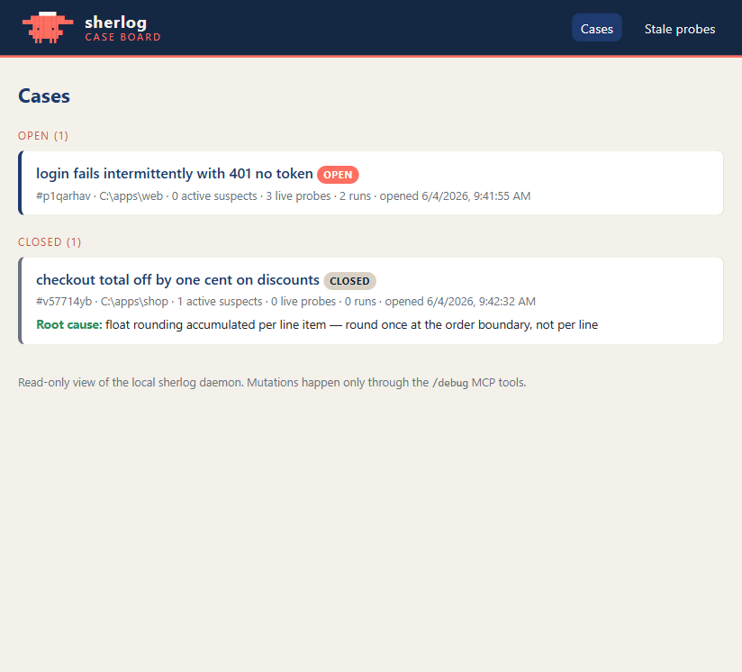

<!-- Hero: terminal mascot sprite (D12) — coral Clawd-cousin "Watson" in a navy
inspector cap. The skill prints this colorized at session start; rendered plain
here. -->
```
     ▄▄▄▄
 ▄▄████████▄▄
   ▐▛███▜▌
  ▝▜█████▛▘
    ▘▘ ▝▝
```

# sherlog

Hypothesis-driven debugging for Claude Code. A single Go binary that runs as a
localhost daemon and an MCP server, plus a `/debug` skill that drives a
detective loop: name suspects, plant one discriminating probe each, wait while
you reproduce the bug, then eliminate suspects from real evidence — and remove
every probe before it calls the case closed.

## What it is

`sherlog` replaces "dump the logs into the chat and hope" with a structured
investigation:

- **Hypothesis-driven.** Claude commits to at least three distinct suspects up
  front, then places a probe per suspect whose output *distinguishes* that
  suspect from its rivals — not a "got here" marker.
- **Blocking wait.** When it is your turn to reproduce the bug, Claude suspends
  on `await_run` until probe activity arrives or it times out. No "type done
  when you're ready" — the daemon tells Claude when the evidence stops flowing.
- **Query, not dump.** Evidence enters Claude's context as filtered, aggregated
  query results (per-probe counts, first/last samples) — never raw log floods.
  A probe stuck in a hot loop is bounded to first/last N plus an exact counter.
- **Browser support.** Probes are plain HTTP POSTs with no JSON `Content-Type`,
  so browser JavaScript probes are CORS "simple requests" with no preflight.
  The same one-liner works in the browser, Node, Python, Go, Ruby, or a shell.

The investigation state — bug description, hypothesis board, probe registry, run
history — lives in the daemon, not in the conversation. It survives `/clear`,
context compaction, a crash, or picking the case back up days later via
`/debug resume`.

## Why

Folder-based AI debug loops can't reach browser code, can't filter high-volume
logs, and routinely leave orphaned debug statements behind. sherlog addresses
each of those at the infrastructure level: a resident daemon for browser-safe
ingest and querying, and a probe registry that makes every placed probe
findable and removable — even by a later session that has no memory of placing
it.

## Install

sherlog has two parts that version together: the binary (via Homebrew) and the
Claude Code plugin. **Install the binary first** — the plugin's MCP server
launches `sherlog` from your PATH.

1. **Binary** (Homebrew, macOS/Linux):

   ```sh
   brew install neomodular/tap/sherlog
   sherlog --version
   ```

2. **Plugin** (Claude Code): add this repository as a plugin marketplace source
   and install the `sherlog` plugin. The plugin ships `.mcp.json`, which launches
   `sherlog mcp`; once the binary is on PATH, `/debug` is available with no
   further configuration.

If the plugin's MCP server fails to start, the binary is almost certainly not on
PATH — run the `brew install` above. (Windows is supported for `go build`
development but is not yet packaged; brew covers macOS and Linux.)

## How it works

```
┌─────────────────────────────────────────────────────────────┐
│  your app (any language, including browser JS)              │
│  POST http://127.0.0.1:2218/log/<session>/<probe>           │
└──────────────────────────┬──────────────────────────────────┘
                           │ HTTP, loopback only
                           ▼
┌─────────────────────────────────────────────────────────────┐
│  sherlog daemon                                             │
│  ingest │ session state │ hypothesis board │ runs │ query   │
└──────────────────────────┬──────────────────────────────────┘
                           │ same binary, `sherlog mcp` stdio mode
                           ▼
┌─────────────────────────────────────────────────────────────┐
│  Claude Code plugin: MCP tools + /debug skill (the brain)   │
└─────────────────────────────────────────────────────────────┘
```

The `sherlog mcp` process auto-spawns the daemon (detached) if port 2218 is not
already answering, so there is no separate daemon to start.

## Case Board (browser UI)

While the daemon is running, open **`http://127.0.0.1:2218/`** in any browser to
watch the investigation. The Case Board is served by the daemon itself (embedded
in the binary — no install, no separate process, no external requests):

- **Cases** — every investigation, open ones first, then closed cases with a
  one-line resolution (root cause + fix) so the archive of solved bugs is
  browsable.
- **Case detail** — the suspect board (each hypothesis with its status and
  evidence note), the probe registry with `file:line`, the run timeline with
  verdicts, and an **evidence tail that streams live** while you reproduce the
  bug — the "watch the detective work" view, with no page reload.
- **Run comparison** — pick any two runs and see each probe side by side
  (counts and sample values); divergent probes are pinned to the top, so the
  difference between a failing run and a fixed-check run jumps out.
- **Stale probes** — every registered-but-not-removed probe across all cases,
  with the `file:line` to delete.



> _Screenshot: the Cases view. More views (case detail, run comparison) are in
> [`examples/board-screens/`](examples/board-screens/)._

**The Case Board is strictly read-only.** It never closes, edits, or deletes
anything — every mutation still goes through the `/debug` MCP tools. If
`SHERLOG_PORT` is set, the board is at that port instead.

## The probe contract

A probe is **one fire-and-forget line** inserted into your code. The rules:

- **Never await it, never let it throw.** A down daemon must be silent; the probe
  must never block or break the host app.
- **Never set a JSON `Content-Type`.** Bodies go as default `text/plain` so
  browser probes stay CORS simple requests (no preflight). The daemon parses the
  body as JSON opportunistically and falls back to storing it as a raw string —
  a probe can never fail validation.
- **No new imports or wrappers** where the language allows a bare call. Put the
  discriminating values straight in the body.

`debug_start` returns the URL template and a canonical probe form per language —
one line where the language allows it, a short snippet where it does not. Swap
`<probe>` for the registered probe ID:

| Language | Probe form |
|---|---|
| JS (browser/Node) | `fetch("http://127.0.0.1:2218/log/<session>/<probe>", {method:"POST", body: JSON.stringify({/* values */})}).catch(() => {})` |
| Python (3-line snippet — `import`+`try` cannot share one physical line) | `import urllib.request, json` <br> `try: urllib.request.urlopen(urllib.request.Request("http://127.0.0.1:2218/log/<session>/<probe>", data=json.dumps({}).encode())).close()` <br> `except Exception: pass` |
| Go | `go func(){ if r, err := http.Post("http://127.0.0.1:2218/log/<session>/<probe>", "", strings.NewReader("{}")); err == nil { r.Body.Close() } }()` |
| Ruby | `begin; require "net/http"; Net::HTTP.post(URI("http://127.0.0.1:2218/log/<session>/<probe>"), "{}"); rescue StandardError; end` |
| curl | `curl -s -X POST --data '{}' "http://127.0.0.1:2218/log/<session>/<probe>" >/dev/null 2>&1 &` |

## Security

sherlog is built for local debugging only, with defense in depth:

- **Loopback only.** The daemon binds `127.0.0.1:2218`; it is never reachable off
  the machine.
- **Unguessable session paths.** Any web page can POST to a localhost port, so
  the session segment of the probe URL is a random token generated per session.
  Without it, drive-by localhost POSTs go nowhere.
- **Unknown sessions are dropped.** Requests whose session segment matches no open
  session are silently discarded — no state is created from unsolicited traffic.
- **Field notes stay local.** When sherlog itself misbehaves, the `/debug` skill
  may file a private *field note* (`report_observation`) for the maintainer,
  appended to `~/.sherlog/field-notes.jsonl`. These notes can quote investigation
  context — including values seen by probes — so, like everything else sherlog
  stores, they never leave your machine: there is no upload or telemetry anywhere.
  Read them with `sherlog notes` (`--category` to filter); delete the file to
  discard them.
- **Read-only Case Board.** The browser UI (`http://127.0.0.1:2218/`) only ever
  issues `GET` requests; it has no path to mutate sessions, probes, runs, or logs
  — those stay exclusive to the MCP tools. It is served on the same loopback
  listener and is not reachable off the machine. Be aware that it exposes
  investigation data — including values seen by probes — to **any local browser
  user**: the same trust boundary as the files under `~/.sherlog`. If others share
  your machine session, treat the board as you would those files.

To override the port (e.g. 2218 is taken), set `SHERLOG_PORT`. Probe URLs are
always generated from the template the daemon returns, so the override
propagates into every emitted probe line automatically.

## Configuration

Every tuning value has a built-in default; an absent config file means today's
behavior, so configuration is entirely optional. To change a value, edit
`~/.sherlog/config.json` or use the CLI:

```sh
sherlog config list                 # every key, its effective value, and source
sherlog config get flood_keep       # one value
sherlog config set flood_keep 50    # validate and persist one value
```

**Precedence** (highest wins): environment variable → config file → built-in
default. Only `SHERLOG_PORT` exists as an env override, and it stays authoritative
over a `port` in the file. `config list` shows each value's source
(`default` / `file` / `env`) so you can see *why* a setting is what it is; the same
effective config is on `GET /health`.

| Key | Default | Range / values | Effect |
|---|---|---|---|
| `port` | `2218` | 1–65535 | Daemon TCP port (loopback only). `SHERLOG_PORT` overrides it. |
| `flood_keep` | `20` | 1–1000 | First/last-N events retained per probe per run; the middle is dropped with the exact total still disclosed. Raise it for chatty apps. |
| `await_debounce_seconds` | `2` | 0–30 | How long probe activity must stay quiet before `await_run` returns early. |
| `await_max_timeout_seconds` | `600` | 30–3600 | Upper clamp on an `await_run` timeout. Also bounds the default 120s wait used when no client timeout is given, so setting it below 120 shortens default awaits too. |
| `retention_days` | `0` | ≥ 0 | Prune closed sessions older than N days. `0` keeps everything forever. |
| `verbosity` | `detective` | `detective` \| `minimal` | Skill presentation: `minimal` drops the mascot/vocabulary, keeps the discipline. |
| `color` | `auto` | `auto` \| `always` \| `never` | ANSI color in the skill banner. `never` strips all escapes. |

Keys are strict: an unknown key (e.g. a typo like `flod_keep`) fails loading with
a clear error rather than being silently ignored.

Changes apply on the **next daemon start** — there is no hot reload. Restart the
daemon (or stop it and let the next tool call re-spawn it) to pick up a change.

> **Retention deletes data.** With `retention_days > 0`, closed sessions older
> than the window are deleted from `~/.sherlog` (disk and memory) at startup and
> every 24 hours; each prune logs the session IDs it removed. Open sessions are
> never pruned. If you value the archive of past cases, leave `retention_days` at
> its default of `0`.

## Using /debug

A typical investigation:

1. **Open the case.** `/debug` — describe the bug (or let Claude ask one or two
   sharp questions). Claude calls `debug_start` and prints the banner.
2. **Name suspects.** Claude commits at least three distinct root-cause
   hypotheses to the board.
3. **Plant probes.** One discriminating probe per suspect, each registered with
   its file, line, and the hypothesis it tests.
4. **The game is afoot.** Claude asks you to reproduce the bug (rebuild/restart
   if the app is compiled or bundled) and suspends on `await_run`. For a slow
   reproduction, it just re-attaches to the same open run.
5. **Verdict.** You report `reproduced` / `not-reproduced`; Claude records it and
   reads the per-probe evidence summary, killing or refining suspects.
6. **Fix and verify.** Once one suspect is confirmed, Claude fixes it, runs a
   `fixed-check` reproduction, and confirms the failure signature changed as
   predicted before saying **"elementary."**
7. **Case closed.** `debug_end` lists every probe not yet removed. Claude deletes
   them and greps the repo for the session URL fragment, requiring zero matches
   before declaring **"case closed."**

### Resuming

`/debug resume` reconstructs an investigation from the daemon board — the latest
open session, or a named one. The board is the source of truth, so resume works
after `/clear`, compaction, a crash, or days later.

### Leftover probes, weeks later

Even if a session is long gone, the safety net is:

```sh
sherlog probes --stale
```

It lists every probe registered but never marked removed, across all sessions,
with the session, file, and line — so you can clean up orphans by hand.

### Downgrading the binary

Don't run an older `sherlog` against state written by a newer one. Once a newer
build has written an adoption marker into `~/.sherlog/<session>/logs.jsonl`, an
older event-only build mis-reads that marker line as a phantom empty orphan
instead of skipping it. Downgrade-after-upgrade is unsupported; stay on the
newer build, or clear the session state before rolling back.

## Port 2218

221B Baker Street — Sherlock Holmes's address. The fixed port is the brand and
what makes a sherlog probe instantly recognizable in a diff.

## License

MIT — see [LICENSE](LICENSE).
